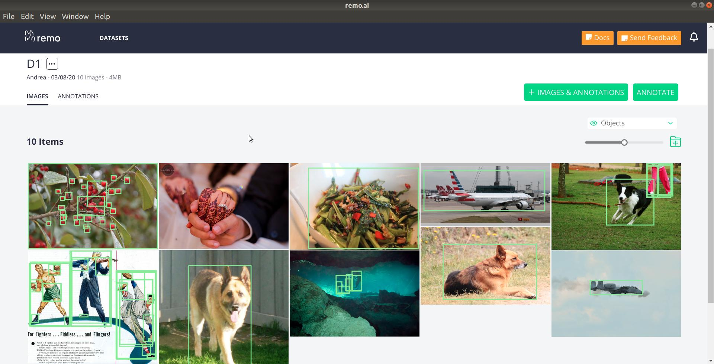
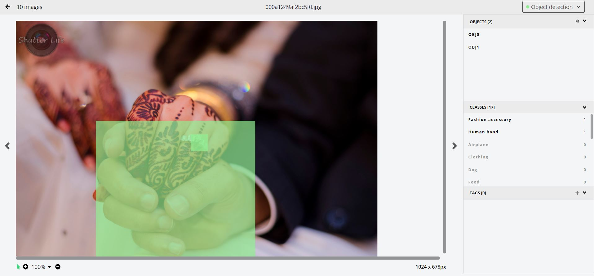

# Uploading Annotations

In this tutorial, we explore some different options to upload annotations in Remo. We will:

- add annotations from a file in a format supported by remo
- add annotations from code, which enables uploading annotations from any input format
- introduce the concept of Annotation Sets, for finer control over annotations

We start off by creating a dataset and populating it with some images


```python
%load_ext autoreload
%autoreload 2
import sys

local_path_to_repo =  'C:/Users/Andrea.LaRosa/Projects/repo/rem_repo/remo-python/'

sys.path.insert(0, local_path_to_repo)

import remo
import os
import pandas as pd

urls = ['https://remo-scripts.s3-eu-west-1.amazonaws.com/open_images_sample_dataset.zip']
my_dataset = remo.create_dataset(name = 'D1', urls = urls)
```

    Launching Remo server ...
    Wait a bit...  5
    Wait a bit...  4
    Wait a bit...  3
    
        (\(\ 
        (>':') Remo server is running: {'app': 'remo', 'version': '0.3.13-49-g6f229ef8'}
                        
    

## Add annotations stored in a file supported by remo

**To add annotations from a supported file format, we can pass the file via `dataset.add_data`**

Remo automatically parses annotation files in a variety of formats (such as Pascal XML, CoCo JSON, Open Images CSV, etc). You can read more about file formats supported by remo in [our documentation](https://remo.ai/docs/annotation-formats/).


**As an example, let's add some annotations for an Object Detection task from a CSV file with encoded classes**

In this case, annotations are stored in a CSV file in a format already supported by Remo. Class labels were encoded using [GoogleKnowledgeGraph](https://developers.google.com/knowledge-graph). Remo automatically detects the class encoding and translates it into the corresponding labels


```python
annotation_files=[os.getcwd() + '/assets/open_sample.csv']

df = pd.read_csv(annotation_files[0])
df.columns
```


    Index(['ImageID', 'Source', 'LabelName', 'Confidence', 'XMin', 'XMax', 'YMin',
           'YMax', 'IsOccluded', 'IsTruncated', 'IsGroupOf', 'IsDepiction',
           'IsInside'],
          dtype='object')


```python
my_dataset.add_data(local_files=annotation_files, annotation_task = 'Object detection')
```


    {'files_link_result': {'files uploaded': 0, 'annotations': 9, 'errors': []}}


We can now see annotation statistics, explore the dataset and further leverage Remo


```python
my_dataset.get_annotation_statistics()
```


    [{'AnnotationSet ID': 1,
      'AnnotationSet name': 'Object detection',
      'n_images': 9,
      'n_classes': 15,
      'n_objects': 84,
      'top_3_classes': [{'name': 'Fruit', 'count': 27},
       {'name': 'Sports equipment', 'count': 12},
       {'name': 'Human arm', 'count': 7}],
      'creation_date': None,
      'last_modified_date': '2020-03-23T15:31:38.988851Z'}]


```python
remo.set_viewer('jupyter')
my_dataset.view()
```

    Open http://localhost:8123/datasets/1
    


<iframe
    id="remo_frame_cea49067-f94b-4bea-bf0e-1792e4774e5e"
    width="100%"
    height="100px"
    src="http://localhost:8123/datasets/1?allheadless"
    frameborder="0"
    allowfullscreen
></iframe>
<script type="text/javascript">
    (function () {
        const iframe = document.getElementById("remo_frame_cea49067-f94b-4bea-bf0e-1792e4774e5e");
        let timeout, delay = 100;

        const setHeight = () => {
          const width = iframe.clientWidth;
          iframe.style.height = (width * screen.height / screen.width) * 0.8 + 'px';
        }
        window.addEventListener("resize", () => {
            clearTimeout(timeout);
          // start timing for event "completion"
          timeout = setTimeout(setHeight, delay);
        });
        setHeight();
    })()
</script>


 

## Add annotations from code

**We can also easily to add annotations from code via the `Annotation` object**


This can be useful for instance to:
- visualize model predictions as part of a model training worfklow
- upload annotations from any custom file format

As an example, let's see how we can add annotations to a specific image

First, let's retrieve one image 


```python
images = my_dataset.images()
my_image = images[1]
print(my_image)
print('Resoultion: ', my_image.width, 'x', my_image.height)
```

    Image: 3408 - 000a1249af2bc5f0.jpg
    Resoultion:  1024 x 678
    

Now we can easily add annotations using `add_annotations()` method of the dataset class


```python
annotations = []

annotation = remo.Annotation()
annotation.img_filename = my_image.name
annotation.classes='Human hand'
annotation.bbox=[227, 284, 678, 674]
annotations.append(annotation)

annotation = remo.Annotation()
annotation.img_filename = my_image.name
annotation.classes='Fashion accessory'
annotation.bbox=[496, 322, 544,370]
annotations.append(annotation)

my_dataset.add_annotations(annotations)
```

    Progress 100% - 1/1 - elapsed 0:00:01.001000 - speed: 1.00 img / s, ETA: 0:00:00
    


```python
my_dataset.view_image(my_image.id)
```

    Open http://localhost:8123/image/3408?dataset_id=25
    

 

## Annotation sets

------------------------ THIS SECTION IS WORK IN PROGRESS ------------------------

**Behind the scenes, Remo organises annotations in Annotation sets. An annotation set is simply a collection of all the annotations of Dataset.**

An annotation set is characterized by a task (such as 'Object Detection') and a list of classes, besides of course the actual annotations.

The advantage of grouping annotations in an Annotation Set is that it allows for high-level group operations on all the annotations, such as:
- grouping classes together
- deleting objects of specific classes
- comparing of different annotations (such as ground truth vs prediction, or annotations coming from different annotators)

In the examples we have seen before, Remo automatically creates an annotation set and sets it as default. For more control, it's however possible to explicit manipulate Annotation sets objects.


**Let's first create an empty annotation set with a predetermined list of classes**


```python
my_classes = ['Airplane', 'Clothing', 'Dog', 'Fashion accessory', 'Food', 'Footwear', 'Fruit', 'Human arm', 
         'Human body', 'Human hand', 'Human leg', 'Mammal', 'Man', 'Person', 'Salad', 'Sports equipment', 'Trousers', 'Woman']

annotation_set = my_dataset.create_annotation_set(annotation_task = 'Object detection',
                                          name = 'Objects',
                                          classes = my_classes)
```

We can easily retrieve different annotation sets of a dataset


```python
my_dataset.annotation_sets()
```


    [Annotation set 15 - 'Object detection', task: Object detection, #classes: 15,
     Annotation set 16 - 'my_ann_set_2', task: Object detection, #classes: 3]


When adding the file to an existing annotation set, remo automatically only adds annotations for classes that are part of that annotation set. It's possible to add classes to an annotation set, but we require this to be done explicitly.


```python

```
